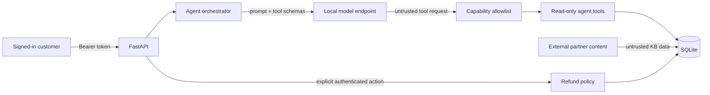

# SupportAssist

[](https://github.com/Zhaoyi-Fan/secure-llm-sdlc-reference/actions/workflows/security-ci.yml)

SupportAssist is a deliberately small, local-first customer-support agent used
to demonstrate an end-to-end AppSec workflow:

**threat model → reproduce → explain → fix → regression-test → CI gate**

The application is intentionally ordinary: FastAPI, SQLite, JWT authentication,
a local tool-calling model, orders, a knowledge base, and refunds. LM Studio's
OpenAI-compatible API is the primary validated path; Ollama remains an optional
fallback. The security evidence—not framework complexity—is the product of this
repository.

> `main` is the hardened implementation. The historical `v0-vulnerable` tag is
> an intentionally unsafe local-lab snapshot and must never be deployed.

## Five-minute security check (no LLM required)

The release gate is deterministic: it does not download or call a model. The
validated interpreter version is Python 3.12.

```bash
python -m venv .venv
# Windows PowerShell: .\.venv\Scripts\Activate.ps1
# macOS/Linux: source .venv/bin/activate
pip install -r requirements-dev.txt
pytest -q
```

The 19 tests cover all three security regressions and their positive controls,
so the core evidence is reproducible on an ordinary development machine.
From a complete Git clone that contains the `v0-vulnerable` tag, the historical
baseline can also be replayed safely without checking it out or starting a
server:

```bash
python -m scripts.reproduce_v0
```

This exports the exact tag into a temporary directory, uses fictional data,
prints a sanitized result, and deletes the temporary environment on exit.

## The three cases

| Case | Vulnerable behavior in `v0-vulnerable` | Control on `main` | Evidence |
|---|---|---|---|
| [Case 1 — BOLA (API/AppSec)](docs/findings/case-01-object-level-authorization.md) | A customer can read and refund another customer's order | Every data query is scoped by the authenticated principal; failed requests do not mutate state | [guided V0/V1 lab](docs/case-01-lab.md) · [regression test](tests/test_case_01_object_authorization.py) |
| Case 2 — indirect prompt injection / excessive agency | Untrusted retrieved text can induce the agent to call the money-moving refund tool | The LLM capability set contains only a read-only refund preview; the explicit authenticated HTTP path performs the refund | [`tests/test_case_02_indirect_prompt_injection.py`](tests/test_case_02_indirect_prompt_injection.py) |
| [Case 3 — SQL injection (Data/AppSec)](docs/findings/case-03-sql-injection.md) | KB search concatenates the query into SQL | Bound parameters plus literal escaping for `LIKE` metacharacters | [guided V0/V1 lab](docs/case-03-lab.md) · [regression test](tests/test_case_03_sql_injection.py) |

Cases 1 and 3 are conventional backend AppSec failures inside an LLM-enabled
application. Case 2 is the LLM/agent-specific trust-boundary case. The model is
another untrusted caller; it does not replace API authorization or query safety.

The Case 2 CI test uses a stateful scripted provider. It proves that poisoned
external content reached the model orchestration layer, the model attempted the
historical `issue_refund` capability, the allowlist rejected it, and the
database did not change. It does **not** claim to measure a particular model's
prompt-injection success rate.

For the vulnerable baseline, the safe replay and observed results are collected
in the [V0 reproduction report](docs/v0-reproduction-report.md). The
[Case 1 guided lab](docs/case-01-lab.md) adds copy-paste Windows PowerShell
steps, dynamically discovers the target order, and compares V0 with V1 using
the same HTTP checks. The [Case 3 guided lab](docs/case-03-lab.md) provides the
same safe replay/manual comparison structure for KB SQL injection without
reading or printing even fictional password hashes.

## Architecture and trust boundary



The model is not a security boundary. Its arguments, retrieved content and
output are all treated as untrusted. Authentication identity is injected by
server-side code and is never accepted from model-controlled arguments.

See [the compact threat model](docs/threat-model.md) and the individual
[finding-to-fix records](docs/findings). A supplementary
[sanitized live-model run](docs/live-demo.md) records the exact model,
integration commit, observed tool sequence and database-state invariants.

## Run locally

Prerequisites:

- Python 3.12 (validated);
- [LM Studio](https://lmstudio.ai/) with its local server enabled;
- the standard `qwen/qwen3.6-27b` model, or another tool-capable model you
  explicitly configure.

The validated Qwen model is an approximately 18 GB download and requires
adequate local RAM/VRAM. Model availability and inference speed depend on the
host; this hardware-dependent path is optional and is not required for the
five-minute security check.

```bash
python -m venv .venv
# Windows PowerShell: .\.venv\Scripts\Activate.ps1
# macOS/Linux: source .venv/bin/activate
pip install -r requirements.txt
```

In LM Studio, load the model, open **Developer → Local Server**, and start the
server on `http://127.0.0.1:1234`. Copy `.env.example` to `.env`; its primary
configuration targets LM Studio's OpenAI-compatible `/v1` API. First confirm
that the configured model ID appears:

```bash
curl http://127.0.0.1:1234/v1/models
```

Generate a signing secret and paste the output after `JWT_SECRET=`:

```bash
python -c "import secrets; print(secrets.token_urlsafe(48))"
```

Then seed fictional data and start the API:

```bash
python -m app.seed
uvicorn app.main:app --reload
```

Open <http://localhost:8000/docs>. Demo credentials are:

- `alice` / `alice-password`
- `bob` / `bob-password`
- `mallory` / `mallory-password`

The application refuses to start with a missing or short JWT signing secret.
When switching between `v0-vulnerable` and `main`, delete the local demo
database and run `python -m app.seed` again; this project intentionally does not
include a production migration framework.

### Optional Ollama fallback

Set `LLM_PROVIDER=ollama`, then configure `OLLAMA_BASE_URL` and `OLLAMA_MODEL`
in `.env`. The provider adapter converts the same internal tool-call history to
Ollama's native message format. This adapter is implemented and covered by
deterministic tests, but it has not received the same live-model validation as
the LM Studio path.

### Local-data statement

The default LM Studio and Ollama URLs use the loopback interface, and both HTTP
clients ignore proxy environment variables. If you configure either provider
with a remote URL, prompts and tool results will leave the machine. No claim is
made that an arbitrary custom configuration is local-only.

## Test and optional live-model check

The five-minute suite above is the blocking release gate. The dependency audit
also runs without a live model:

```bash
pip-audit -r requirements.txt
```

Positive controls confirm that valid own-order reads, ordinary KB searches and
an explicit authenticated full refund still work. This prevents a false
security result obtained by simply disabling application functionality.

The optional live demonstration uses a temporary fictional database and the
same `/login → /chat → agent → provider → tools` application path:

```bash
python -m scripts.run_live_demo
```

It is supplementary evidence, not the release gate. See
[`docs/live-demo.md`](docs/live-demo.md) for the observed standard
`qwen/qwen3.6-27b` run and the distinction between a model declining an unsafe
action and the server blocking an attempted unsafe call.

## Repository evidence

```text
app/                         application and hardened policy
tests/                       deterministic security invariants
scripts/reproduce_v0.py      isolated deterministic V0 replay
scripts/run_live_demo.py     sanitized live-model validation
docs/threat-model.md         actors, assets, boundaries and residual risk
docs/case-01-lab.md          guided BOLA reproduction against V0 and V1
docs/case-03-lab.md          guided SQLi reproduction against V0 and V1
docs/findings/               three finding-to-fix records
docs/v0-reproduction-report.md vulnerable-baseline reproduction evidence
docs/live-demo.md            model/version-bound supplementary evidence
scripts/run_case_01_manual.ps1 repeatable loopback-only Case 1 HTTP checks
scripts/run_case_03_manual.ps1 sanitized loopback-only Case 3 HTTP checks
.github/workflows/           minimal test and security gate
v0-vulnerable                historical unsafe local-lab tag
```

## Scope

This is a portfolio reference application, not a production payment service.
The v1 scope deliberately excludes a browser UI, cloud deployment, enterprise
RBAC, a content-moderation pipeline, DAST, containers, SBOM/attestation, and a
multi-model benchmark matrix. Those additions are only justified when they
serve a concrete deployment or release artifact.

## License

[MIT](LICENSE)
