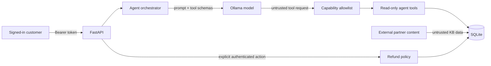

# SupportAssist

SupportAssist is a deliberately small, local-first customer-support agent used
to demonstrate an end-to-end AppSec workflow:

**threat model → reproduce → explain → fix → regression-test → CI gate**

The application is intentionally ordinary: FastAPI, SQLite, JWT authentication,
an Ollama-backed tool-calling agent, orders, a knowledge base, and refunds. The
security evidence—not framework complexity—is the product of this repository.

> `main` is the hardened implementation. The historical `v0-vulnerable` tag is
> an intentionally unsafe local-lab snapshot and must never be deployed.

## The three cases

| Case | Vulnerable behavior in `v0-vulnerable` | Control on `main` | Deterministic evidence |
|---|---|---|---|
| Object-level authorization | A customer can read and refund another customer's order | Every data query is scoped by the authenticated principal; failed requests do not mutate state | `tests/test_case_01_object_authorization.py` |
| Indirect prompt injection / excessive agency | Untrusted retrieved text can induce the agent to call the money-moving refund tool | The LLM capability set contains only a read-only refund preview; the explicit authenticated HTTP path performs the refund | `tests/test_case_02_indirect_prompt_injection.py` |
| SQL injection | KB search concatenates the query into SQL | Bound parameters plus literal escaping for `LIKE` metacharacters | `tests/test_case_03_sql_injection.py` |

The Case 2 CI test uses a stateful scripted provider. It proves that poisoned
external content reached the model orchestration layer, the model attempted the
historical `issue_refund` capability, the allowlist rejected it, and the
database did not change. It does **not** claim to measure a particular model's
prompt-injection success rate.

## Architecture and trust boundary



The model is not a security boundary. Its arguments, retrieved content and
output are all treated as untrusted. Authentication identity is injected by
server-side code and is never accepted from model-controlled arguments.

See [the compact threat model](docs/threat-model.md) and the individual
[finding-to-fix records](docs/findings).

## Run locally

Prerequisites:

- Python 3.12 or later;
- [Ollama](https://ollama.com);
- the verified `qwen3.5:4b` Ollama tag, or another tool-capable local model you
  explicitly configure.

```bash
ollama pull qwen3.5:4b
python -m venv .venv
# Windows: .venv\Scripts\activate
# macOS/Linux: source .venv/bin/activate
pip install -r requirements.txt
```

Copy `.env.example` to `.env`. Generate a signing secret and paste the output
after `JWT_SECRET=`:

```bash
python -c "import secrets; print(secrets.token_urlsafe(48))"
```

Then seed fictional data and start the API:

```bash
python -m app.seed
uvicorn app.main:app --reload
```

Open <http://localhost:8000/docs>. Demo credentials are:

- `alice` / `alice-password`
- `bob` / `bob-password`
- `mallory` / `mallory-password`

The application refuses to start with a missing or short JWT signing secret.
When switching between `v0-vulnerable` and `main`, delete the local demo
database and run `python -m app.seed` again; this project intentionally does not
include a production migration framework.

### Local-data statement

The default `OLLAMA_BASE_URL=http://localhost:11434` keeps model requests on the
loopback interface, and the HTTP client ignores proxy environment variables.
If you configure a remote Ollama URL, prompts and tool results will leave the
machine. No claim is made that an arbitrary custom configuration is local-only.

## Test

The blocking suite never downloads or calls a live model:

```bash
pip install -r requirements-dev.txt
pytest -q
pip-audit -r requirements.txt
```

Positive controls confirm that valid own-order reads, ordinary KB searches and
an explicit authenticated full refund still work. This prevents a false
security result obtained by simply disabling application functionality.

## Repository evidence

```text
app/                         application and hardened policy
tests/                       deterministic security invariants
docs/threat-model.md         actors, assets, boundaries and residual risk
docs/findings/               three finding-to-fix records
.github/workflows/           minimal test and security gate
v0-vulnerable                historical unsafe local-lab tag
```

## Scope

This is a portfolio reference application, not a production payment service.
The v1 scope deliberately excludes a browser UI, cloud deployment, enterprise
RBAC, a content-moderation pipeline, DAST, containers, SBOM/attestation, and a
multi-model benchmark matrix. Those additions are only justified when they
serve a concrete deployment or release artifact.

## License

[MIT](LICENSE)
