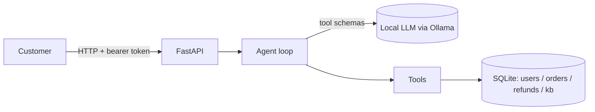

# SupportAssist — secure-LLM-SDLC reference app

A small, self-contained **AI customer-support agent** for a fictional online store,
built as an end-to-end application-security case study: a realistic app, a threat
model, and a set of *find → explain → fix → regression-test* walkthroughs.

The assistant runs entirely against a **local LLM via [Ollama](https://ollama.com)** —
no API keys, and no prompt or customer data leaves your machine. That is a deliberate
data-residency choice, documented in the threat model.

> ⚠️ **Intentionally vulnerable baseline.** The `v0-vulnerable` tag contains planted
> weaknesses used for the case studies. **Do not deploy it on any public / internet-reachable
> host.** The `main` branch tracks the hardened version.

## What it does

A signed-in customer chats with the agent, which can:

- list the customer's orders,
- look up a single order,
- issue a refund,
- search the help-center knowledge base.

## Architecture



Trust boundary: the user's message, knowledge-base text and order notes are all
**untrusted input**. The LLM is *not* a security boundary — authorization and business
rules are enforced server-side, in the tool layer (in the hardened version). Each tool is
also callable directly from the API, so security tests can assert server-side controls
without depending on what the model happens to decide.

## Run it locally

1. Install [Ollama](https://ollama.com) and pull a Qwen 3.6 model. Pick a size for your hardware:

   | Tier | Hardware | Notes |
   |------|----------|-------|
   | small | CPU / low VRAM | runs; weaker tool-calling |
   | medium | 8–16 GB GPU | balanced (default) |
   | large (~27–32B) | 24 GB+ GPU | best agent fidelity |

   Check `ollama list` for the exact tag you pulled and put it in `.env`.

2. Install and run:

   ```bash
   python -m venv .venv && . .venv/bin/activate    # Windows: .venv\Scripts\activate
   pip install -r requirements.txt
   cp .env.example .env                             # then edit OLLAMA_MODEL
   python -m app.seed                               # create + seed the database
   uvicorn app.main:app --reload
   ```

3. Open <http://localhost:8000/docs> (Swagger UI). Log in with `POST /login`
   (demo users: `alice` / `alice-password`, `bob` / `bob-password`), copy the returned
   token into **Authorize**, then try the endpoints or `POST /chat`.

## Project status

- [x] App + agent + tools + seed data (this baseline)
- [ ] Threat model (data-flow diagram + STRIDE)
- [ ] Case studies: authorization, prompt-injection / agent guardrails, injection
- [ ] CI: SAST / SCA / secret-scan / SBOM + build provenance

## License

MIT.
