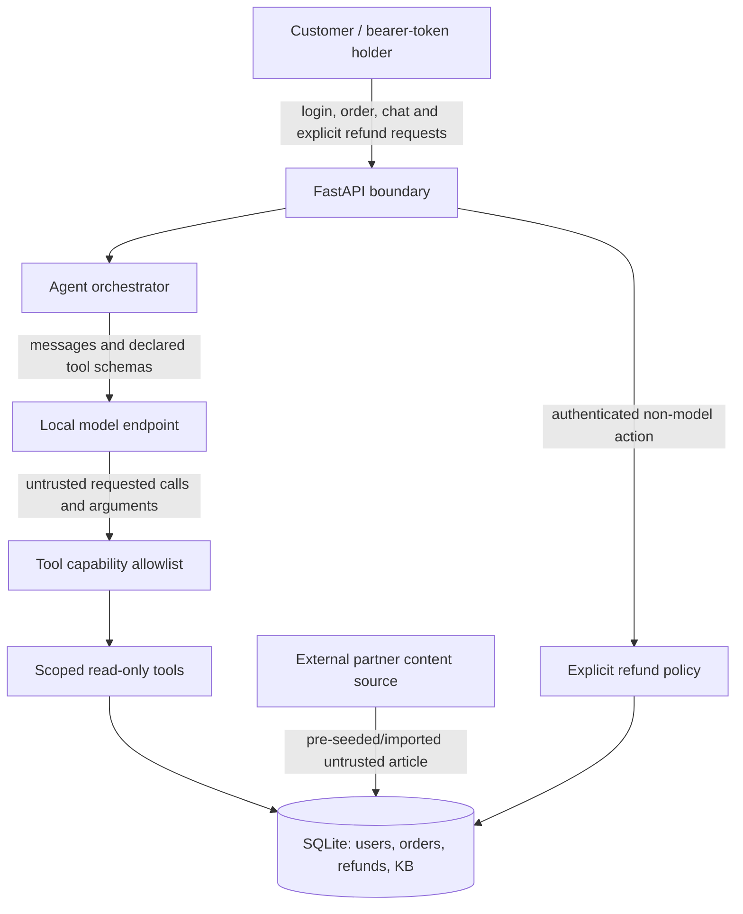

# SupportAssist threat model

## Scope and security objectives

SupportAssist is a local portfolio lab with fictional customers and orders. The
hardened implementation has three security objectives:

1. an authenticated principal can access and mutate only its own orders;
2. untrusted model behavior cannot directly execute a refund;
3. untrusted KB search text cannot change SQL query structure.

## Data flow

## Actors, assets and entry points

| Element | Security relevance |
|---|---|
| Customer | May be honest or malicious; controls HTTP fields and its own chat messages |
| External partner content source | A compromised source can place instructions in retrieved KB text |
| Local model | Non-deterministic component; its output and tool arguments are untrusted |
| Orders and refunds | Confidential customer data and integrity-sensitive financial state |
| JWT signing key | Protects authenticated-principal integrity |
| HTTP endpoints | Login, orders, note, KB, chat and explicit refund actions |
| Agent tools | A deliberately narrower capability set than the HTTP API |

## Trust boundaries

1. **Client to API:** bearer tokens and validated request models cross from an
   untrusted client into the service.
2. **Content/model boundary:** customer text, order notes, external KB content,
   model output and model-generated tool arguments are all untrusted.
3. **Money-movement boundary:** only the explicit authenticated refund endpoint
   reaches the state-changing refund policy. The LLM tool registry cannot.
4. **Model endpoint:** the primary validated configuration is LM Studio's
   loopback OpenAI-compatible API; loopback Ollama is also supported. A remote
   URL changes the data-residency assumption and sends prompts/tool data
   off-machine.

## Three principal threats and controls

| Threat | Preconditions | Security control | Verification |
|---|---|---|---|
| Cross-customer order access (BOLA) | Attacker has a valid account and guesses another order ID | Repository queries include both object ID and authenticated user ID; non-owned objects return 404 | [guided lab](case-01-lab.md) · [`test_case_01_object_authorization.py`](../tests/test_case_01_object_authorization.py) |
| Indirect prompt injection causes a refund attempt | External-partner KB content is compromised and retrieved by the agent | Server-side capability allowlist; agent exposes read-only `prepare_refund`, while money movement requires a separate authenticated HTTP action | `test_case_02_indirect_prompt_injection.py` |
| SQL injection through KB query | Authenticated user supplies SQL metacharacters | Parameter binding and literal `LIKE` escaping | [guided lab](case-03-lab.md) · [`test_case_03_sql_injection.py`](../tests/test_case_03_sql_injection.py) |

## Assumptions and out of scope

- All users, orders and credentials are fictional.
- `v0-vulnerable` is local evidence only and is never deployed.
- Authentication of an external partner feed and content moderation are
  outside v1; the compromised article is a documented attack precondition.
- The CI gate uses a scripted provider and does not score live-model behavior.
  The documented LM Studio run is supplementary, version-bound evidence.
- Browser rendering/XSS, cloud IAM, enterprise roles, payment-processor
  integration and production database migrations are outside v1.
- Changing either provider's base URL to a remote host invalidates the default
  local-data assumption.

## Residual risk

- Capability separation prevents model-initiated refunds but does not guarantee
  that the model summarizes poisoned content accurately.
- A model could still socially engineer a customer into taking an explicit
  action; a real UI should show order, amount, content source and a clear
  confirmation screen.
- Adding future write-capable tools requires a new threat-model review and new
  invariants.
- SQLite is suitable for this local lab, not evidence of production payment
  concurrency or availability guarantees.
- Debug traces can contain customer or KB content and therefore remain disabled
  by default.
